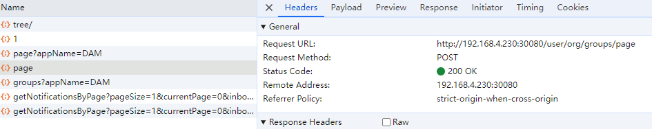

# Datablau DAM Projects
# backend目录:
**所有dam所需的后台微服务**

1. 代码编译和运行必须JDK17
2. 如果编译不了，请先进入**backend/datablau-parent**目录执行``` mvn install ```
3. 启动程序样例： 
```shell
#!/bin/bash
instancename="DatablauMetadata"
PRG="$0"
while [ -h "$PRG" ] ; do
  ls=`ls -ld "$PRG"`
  link=`expr "$ls" : '.*-> \(.*\)$'`
  if expr "$link" : '/.*' > /dev/null; then
    PRG="$link"
  else
    PRG=`dirname "$PRG"`/"$link"
  fi
done
PRGDIR=`dirname "$PRG"`

export METADATA_HOME=/opt/datablau_metadata
export LOCALAPPDATA=$METADATA_HOME
export JAVA_HOME=/usr/lib/java/jdk-17
export JRE_HOME=/usr/lib/java/jdk-17
echo -e "\033[31m-----------------------------------------------------------------\033[0m"
echo -e "\033[34m Copyright ? 2021 Datablau,Inc. All Rights Reserved.\033[0m"
echo -e "\033[31m-----------------------------------------------------------------\033[0m"
echo -e "\033[33m Now, Startup the Datablau $instancename Service...\033[0m"

echo $METADATA_HOME
loginParam=" -Dspring.cloud.nacos.username=[nacos-user] -Dspring.cloud.nacos.password=[nacos-password] "
jLowS="--add-exports java.base/jdk.internal.loader=ALL-UNNAMED --add-exports java.base/jdk.internal.perf=ALL-UNNAMED  --add-opens=java.security.jgss/sun.security.krb5=ALL-UNNAMED"
nohup $JAVA_HOME/bin/java -XX:+UseG1GC -XX:-OmitStackTraceInFastThrow -Xms2g -Xmx8g -jar $jLowS $loginParam  -Djava.io.tmpdir=$METADATA_HOME/tmp   -Dcom.sun.management.jmxremote.ssl=false -Dcom.sun.management.jmxremote.authenticate=false -Dspring.cloud.nacos.discovery.ip=[current-machine-address]   -Dspring.cloud.nacos.discovery.port=[service-expose-port] -Dspring.cloud.nacos.discovery.group=DEFAULT_GROUP -Dspring.cloud.nacos.config.group=DEFAULT_GROUP -Dspring.cloud.nacos.discovery.namespace=datablau70 -Dspring.cloud.nacos.discovery.server-addr=[nacos-server-address]:8848  -Dlogging.file.path=$METADATA_HOME/logs $METADATA_HOME/app/datablau-metadata-server*.jar > /dev/null 2>&1 &
```
## 后端开发样例
所有的内部函数都是public或者protected，而且Bean是通过@ConditionalOnMissingBean来实例化继承的类，实现原有代码逻辑的覆盖。

我们所有的例子都用UserManagement作为样例

比如我们要给用户增加一个属性 “入职日期”，数据库需要增加字段***hire_date***：
### step1： 找到你需要修改的服务：
	 现在的所有的代码都包含了已有的当前微服务的controller源码，所以我们可以把controller作为入口来定位我们需要修改的代码。
* 1. 首先在UI上找到对应的用户列表，找到入口。<br/>
	  <br/>
* 2. 通过F12找到对应的URL<br/>
	   <br/>
	 从图中，我们可以得知这个接口是 user/, 也就是表明这个接口在用户微服务上。<br/>
* 3. 打开用户微服务的代码 **datablau-usermanagement-server** <br/>
* 4. 搜索关键字/org 定位了Controller到 **OrganizationController** <br/>
* 5. 定位到对应的REST API <br/>
```java
  /**  
	 * 分页查询用户组的用户  
	 *  
	 * @return 查询的用户分页结果  
  */  
@Description("分页查询用户组的用户")  
@Operation(summary = "分页查询用户信息")  
@RequestMapping(value = "/groups/page", method = RequestMethod.POST)  
public PageResult<UserDto> pageByNameLikeAndStateIs(@RequestParam(name = "appName", required = false, defaultValue = "") String appName,  
  @RequestBody UserQueryDto userQueryDto) {  
  return organizationVirtualService.pageByNameLikeAndStateIs(appName, userQueryDto);  
}
```

### step2： 增加表和扩展属性： 
_我们需要增加新的Entity和对应的Repository_
- 通过Intellij搜索类，查看当前微服务的JpaConfiguration类，查看类的注解，一般来说，当前微服务的ext.jpa会在jpa的扫描路径中，比如usermanagement的JpaConfiguration的默认扫描路径是:
```java
@Configuration
@EnableJpaRepositories(
    basePackages = {"com.datablau.security.management.jpa", "com.datablau.model.message.jpa", "com.datablau.model.message.repository", "com.datablau.security.management.ext.jpa"}
)
@EnableTransactionManagement
public class JpaConfiguration {
...
}
```

- 在package _**com.datablau.security.management.ext.jpa.entity**_ 中增加类
```java
@Entity
@Table(
    name = "db_users_ext"
)
public class UserExt {

    @Id
    private Long userId;

    @Column(name = "hire_date")
    @Temporal(TemporalType.TIMESTAMP)
    private Date hireDate;

    public Long getUserId() {
        return userId;
    }

    public void setUserId(Long userId) {
        this.userId = userId;
    }

    public Date getHireDate() {
        return hireDate;
    }

    public void setHireDate(Date hireDate) {
        this.hireDate = hireDate;
    }
}
```
- 在package _**com.datablau.security.management.ext.jpa.repository**_ 中增加类
```java
@Repository("userExtRepository")
public interface UserExtRepository extends CrudRepository<Long, UserExt> {

    @Query("SELECT * FROM UserExt ue WHERE ue.userId IN (?1)")
    List<UserExt> findUserExtByUserId(Collection<Long> userIds);
    
}
```


### step3：增加新的DTO，包含扩展属性hireDate：
- 在package **com.datablau.security.management.ext.dto** 中增加UserExtDto类继承UserExt，包含扩展属性hireDate
```java
public class UserExtDto extends UserDto {

    private static final long serialVersionUID = 1L;

    public UserExtDto() {

    }

    //拷贝构造函数，直接拷贝另外一个对象属性
    public UserExtDto(UserDto other) {
        BeanUtils.copyProperties(other, this);
    }

    private Date hireDate;

    public Date getHireDate() {
        return hireDate;
    }

    public void setHireDate(Date hireDate) {
        this.hireDate = hireDate;
    }
}
```
```diff
- 注意:如果在微服务启动的时候报告找不到Repository或者新添加的Entity不是manageed，请检查JpaConfiguration类是否正确配置scanPackages，或者联系产研修复问题
```


### step4: 修改代码逻辑，增加属性：
此处我们有两种方式，由于controller层的代码是开放的，我们可以直接在Controller里面引用UserExtRepository来扩展返回结果，也可以通过扩展UserServiceImpl来补充新的属性
#### 1. **在controller层通过额外查询的方式，补充属性** <br/>
- 在controller里面依赖仓库
```java
public class OrganizationController extends BaseController {

    @Autowired
    private UserExtRepository userExtRepository;

    ...
}
```
- 直接修改RESTAPI的代码，从数据库从Service返回的数据中获取业务主键，然后从UserExt中根据业务主键搜索结果
```java
    @RequestMapping(value = "/groups/page", method = RequestMethod.POST)
    public PageResult<UserExtDto> pageByNameLikeAndStateIs(@RequestParam(name = "appName", required = false, defaultValue = "") String appName,
                                                        @RequestBody UserQueryDto userQueryDto) {
        PageResult<UserDto> users = organizationVirtualService.pageByNameLikeAndStateIs(appName, userQueryDto);
        /**
         *
         * 之前的逻辑是直接返回service的结果，此处我们加工返回值
         * return users; 
         */
        
        Map<Long, UserExtDto> userMap = users.getContent().stream().collect(Collectors.toMap(u->u.getId(), u->new UserExtDto(u)));

        for (UserExt ue : userExtRepository.findUserExtByUserId(userMap.keySet())) {
            userMap.get(ue.getUserId()).setHireDate(ue.getHireDate());
        }
        
        PageResult<UserExtDto> result = new PageResult<>();
        result.setContent(new ArrayList<>(userMap.values()));
        result.setPageSize(users.getPageSize());
        result.setCurrentPage(users.getCurrentPage());
        result.setTotalItems(users.getTotalItems());
        
        return result;
    }
```


#### 2. **在service层通过额外查询的方式，补充属性**
- 通过IDE找到**OrganizationVirtualService**接口的实现类**OrganizationVirtualServiceImpl**
- 找到方法**pageByNameLikeAndStateIs**的实现, 我们可以看到通过IDE的反编译，大部分代码我们都可以看懂，除了个别变量名
```java
    public PageResult<UserDto> pageByNameLikeAndStateIs(String appName, UserQueryDto userQueryDto) {
        PageResult<UserDto> pageResult = new PageResult();
        pageResult.setPageSize(userQueryDto.getPageSize());
        pageResult.setCurrentPage(userQueryDto.getCurrentPage());
        String baseSql = "select distinct u.id, u.bm, u.username, u.first_name, u.email, u.phone, u.title, u.gender, u.enabled, u.creation_time from db_auth_users u  left join db_auth_organization org on u.bm = org.bm";
        String countSql = "select count(distinct u.id) from db_auth_users u  left join db_auth_organization org on u.bm = org.bm";
        if (userQueryDto.getRoleId() != null) {
            baseSql = baseSql + " left join db_auth_user_group ug on u.id = ug.user_id ";
            countSql = countSql + " left join db_auth_user_group ug on u.id = ug.user_id ";
        }
        ...
```
##### service层的代码基本都是**protected**或者**public**的，所以二开的时候应该基于**继承**来实现<br/>
打开**OrganizationVirtualServiceImpl**反编译代码，看到类的注解
```java
@Service("organizationVirtualService")
@ConditionalOnMissingBean(
    name = {"organizationVirtualServiceExt"}
)
public class OrganizationVirtualServiceImpl implements OrganizationVirtualService {
    ...
}
```
```diff
注意：我们如果要替换现有的"organizationVirtualService"的实现，我们需要定义一个新的Bean叫"organizationVirtualServiceExt"
```
```java
@Service("organizationVirtualServiceExt")
public class OrganizationVirtualServiceExtImpl extends OrganizationVirtualServiceImpl {
...
}
```

##### 继承的时候方案选择
* 继承**OrganizationVirtualServiceImpl**的，override方法**pageByNameLikeAndStateIs**
```java
@Override
    public PageResult<UserDto> pageByNameLikeAndStateIs(String appName, UserQueryDto userQueryDto) {
        ...
        //修改sql语句，增加left join
        String baseSql = "select distinct u.id, u.bm, u.username, u.first_name, u.email, u.phone, u.title, u.gender, u.enabled, u.creation_time, due.hire_date "
            + "from db_auth_users u  left join db_auth_organization org on u.bm = org.bm "
            + "left join db_users_ext due on u.id = due.user_id ";
        ...
        User user;
        //增加一个新的map用来保存新的属性值
        Map<Long, Date>  userHireDateMap = new HashMap<>();
        for(Iterator var15 = objectList.iterator(); var15.hasNext(); userList.add(user)) {
            Object[] object = (Object[])var15.next();
            user = new User();
            ...
            //把新的值保存到map
            try {
                if (object[10] != null) {
                    userHireDateMap.put(user.getId(), sdf.parse(sdf.format(object[10])));
                }
            } catch (ParseException var22) {
                throw new AndorjRuntimeException("get hire date failed");
            }
        }
        ...
          //把新的值添加到UserExtDto里面
        List<UserDto> res = this.convertToUserDto(userList, appName).stream().map(u -> {
            UserExtDto uex = new UserExtDto(u);
            uex.setHireDate(userHireDateMap.get(uex.getId()));
            return uex;
        }).collect(Collectors.toList());
        pageResult.setContentDirectly(res);
        ...
        return pageREsult;
    }
```        
* 类似controller，对超类的函数结果加工补充额外的属性
```java
    @Autowired
    private UserExtRepository userExtRepository;
    @Override
    public PageResult<UserDto> pageByNameLikeAndStateIs(String appName, UserQueryDto userQueryDto) {
        //调用基类的方法
        PageResult<UserDto> pageResult = super.pageByNameLikeAndStateIs(appName, userQueryDto);

        Map<Long, UserExtDto> userMap = pageResult.getContent().stream().collect(Collectors.toMap(u->u.getId(), u->new UserExtDto(u)));

        for (UserExt ue : userExtRepository.findUserExtByUserId(userMap.keySet())) {
            userMap.get(ue.getUserId()).setHireDate(ue.getHireDate());
        }

        PageResult<UserDto> result = new PageResult<>();
        result.setContent(new ArrayList<>(userMap.values()));
        result.setPageSize(pageResult.getPageSize());
        result.setCurrentPage(pageResult.getCurrentPage());
        result.setTotalItems(pageResult.getTotalItems());

        return result;
    }
```
```diff
注意：这样修改接口实现，当如果有远程微服务通过httpInvoker调用的时候，由于返回的DTO被改成了UserExtDto,那么远程微服务是解析不了这个数据结构的,所以这样修改是有风险的！！！
```

##### 增加新的接口来实现对应功能 【推荐】
* 定义一个新的接口**OrganizationVirtualServiceExt**, 在继承**OrganizationVirtualServiceImpl**的同时implements接口**OrganizationVirtualServiceExt**
```java
public interface OrganizationVirtualServiceExt {
    //样例函数
    PageResult<UserExtDto> pageByNameLikeAndStateIsExt(String appName, UserQueryDto userQueryDto);
}
```
- 接口的实现
```java
@Service("organizationVirtualServiceExt")
public class OrganizationVirtualServiceExtImpl extends OrganizationVirtualServiceImpl implements
    OrganizationVirtualServiceExt {

   //样例函数
    @Override
    public PageResult<UserExtDto> pageByNameLikeAndStateIsExt(String appName, UserQueryDto userQueryDto) {
        ...
    }
}
```
##### 微服务间调用增加接口
**假定服务提供方为ServiceA, 调用方为ServiceB**
1.  增加新的**Module**，比如datablau-servicea-[projectname]-api
2.  添加新的**interface**和**dto**到module中
3.  deploy这个api库到nexus
4.  在ServiceA的pom.xml和ServiceB的pom.xml中增加对应dependency
5.  在ServiceA中实现接口, 然后继承**HttpExporterConfiguration**， 创建新的类**HttpExporterConfiguration** , 增加类注解`@Configuration("httpExporterConfigurationExt")` ,增加一个新的函数导出新的接口,比如接口名称为**ExampleInterface** ,实现类为**ExampleInterfaceImpl**
```java
@Configuration("httpExporterConfigurationExt")
public class HttpExporterConfigurationExt extends HttpExporterConfiguration {

    @Bean(
        name = {"/ExampleInterface"}
    )
    public HttpInvokerServiceExporter exampleServiceExporter(
        ExampleInterface example) {
        HttpInvokerServiceExporter exporter = new HttpInvokerServiceExporter();
        exporter.setService(example);
        exporter.setServiceInterface(ExampleInterface.class);
        logger.info("ExampleInterface using port httpInvoker");
        return exporter;
    }
    
}
```
6.  在ServiceB中在增加一个新的类**ExtBeanConfiguration**， 增加类注解`@Configuration("extBeanConfiguration")` ,增加一个新的@Bean定义
```java
    @Bean("exampleInterface")
    public RemoteServiceProxyFactoryBean exampleInterface() {
        RemoteServiceProxyFactoryBean remoteServiceProxyFactoryBean = new RemoteServiceProxyFactoryBean();
        remoteServiceProxyFactoryBean.setClient(discoveryClient);
        remoteServiceProxyFactoryBean.setEnabled(true);
        remoteServiceProxyFactoryBean.setRemoteHostAddress(clientName);
        remoteServiceProxyFactoryBean.setRmiFactory(false);
        //本地实现一个空的ExampleInterface
        remoteServiceProxyFactoryBean.setLocalBeanClass(EmptyExampleInterface.class);
        remoteServiceProxyFactoryBean.setServiceUrl("http://@{serverIpAddress}:@{serverPort}/[serviceContext]/ExampleInterface");
        remoteServiceProxyFactoryBean.setTargetApplicationName("serviceA");
        remoteServiceProxyFactoryBean.setServiceInterface(ExampleInterface.class);
        remoteServiceProxyFactoryBean.setServerRefreshInterval(10000L);
        return remoteServiceProxyFactoryBean;
    }

    //在其它微服务中autowire这个Bean
    ...
    @Autowired
    private ExampleInterface example;
    ...
```
##### 样例代码提交到了分支[rd-7.0.2-demo](http://192.168.1.34/datablauex/datablau_dam_projects/-/tree/rd-7.0.2-demo)


# frontend目录:

**所有dam所需的前端代码**

```

```
